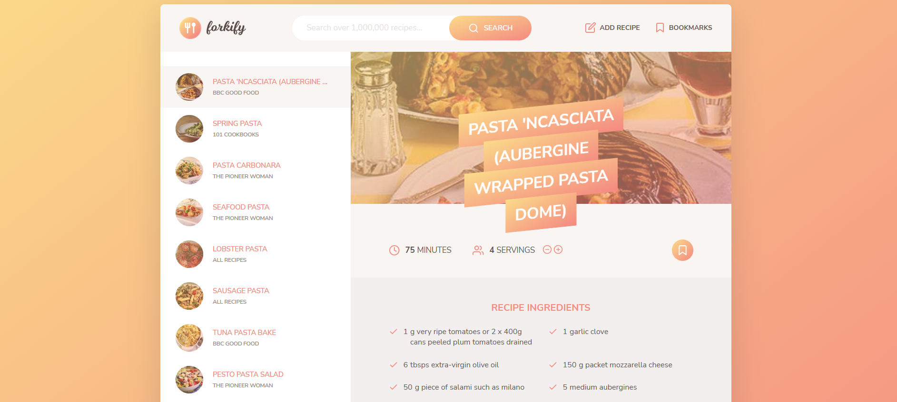

# The-Complete-JavaScript-Course-2023-From-Zero-to-Expert

This repository contains the code that I've written when taking The-Complete-JavaScript-Course-2023-From-Zero-to-Expert from Jonas Schmedtmann course.

It has the following courses:

- JavaScript Fundamentals - Part 1
- JavaScript Fundamentals - Part 2
- Developer Skills % Editor Setup
- HTML & CSS Crash Course
- JavaScript in the Browser:DOM and Event Fundamentals
- How JavaScript Works Behind the Scenes
- Data Structures, Modern Operators and Strongs
- A Closer Look at Functions
- Working With Arrays
- Numbers, Dates, Intl and Timers
- Advanced DOM and Events
- Object-Oriented Programming (OOP) With JavaScript
- Mapty App: OOP, Geolocation, External Libraries and More!
- Asynchronous JavaScript: Promises, Async/Await, and AJAX
- Modern JavaScript Development: Modules, Tooling, and Functional
- Forkify App: Building a Modern Application
- Setting Up Git and Deployment

More information [here](udemy.com/course/the-complete-javascript-course).

Final Project: Forkify

<!-- PROJECT LOGO -->
 

  
  <h1 align="center">Forkify</h1>

  

    <a href="https://forkify-plum.vercel.app//">Live Demo</a>
    ·
    <a href="https://github.com/szabolcsthedeveloper/The-Complete-JavaScript-Course-2023-From-Zero-to-Expert-/issues">Report Bug</a>
        
  

Project 1: Pig Game
👉 **[Live Demo](https://project-pig-game-js.netlify.app/)**

Project 2: Bankist
👉 **[Live Demo](https://project-mapty-js.netlify.app/)**

Project 3: Mapty
👉 **[Live Demo](https://project-mapty-js.netlify.app/)**

